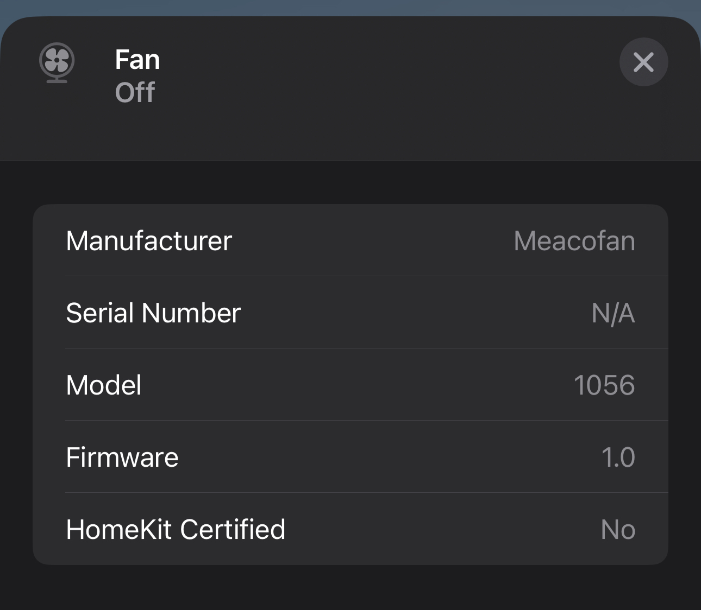

# Homebridge MeacoFan 1056

A plugin for [HomeBridge](https://homebridge.io/) which enables control of a MeacoFan 1056 using a
Raspberry Pi Pico (or other Arduino-compatible microcontroller) as an IR emitter.

It's a bit wonky, but it just about works! It's easily possible for the fan and HomeKit to get out
of sync if one of the commands is missed, but if the emitter is aimed well enough, this doesn't seem
to happen often enough to be an issue.

Just power control for now, but speed is theoretically possible too!

## Usage

1. Connect an IR led to pin 16 of your Pico. (I did so with a 2N3904 NPN transistor to boost the
   brightness a bit.)
2. Use the Arduino IDE to flash the sketch in `pico/sketch` to it.
3. Connect the Pico to the device which is running HomeBridge.
4. Install this plugin.
